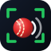

# Cricket Live Overlay Studio

Broadcast-style live cricket overlays for OBS, with a drag-and-drop editor.

- **Studio** (`/studio`) — arrange widgets on a 1920×1080 canvas, style them, save named scenes, fire event banners.
- **Output** (`/output`) — a transparent 1080p page for an OBS Browser Source. It mirrors the Studio live.
- **Server** — the only thing that talks to the cricket API. Polls once for every screen, detects FOUR / SIX / WICKET / milestones, stores scenes as JSON, pushes everything over one WebSocket.

```
cricket API ──► server (poll · diff events · scenes) ──ws──► Studio (edits ↑, state ↓)
                                                     └─ws──► Output ──► OBS Browser Source (webcam below it)
```

## Quick start

Needs Node 22+.

```bash
npm install
cp .env.example .env      # mock provider works with no API key
npm run dev
```

- Studio: http://localhost:4200/studio
- Output: http://localhost:4200/output

Pick **MUM v CHE (fast replay)** in the match picker to watch the mock match play one ball a second, with fours, sixes, wickets, two fifties, an innings break and a last-ball finish. **(chase)** jumps straight into the second innings.

For streaming, use the built version: one process, one port, smaller pages.

```bash
npm run build
npm start                 # http://localhost:4300/studio and /output
```

## OBS setup

1. Settings → Video: canvas and output resolution **1920×1080**.
2. Add a **Video Capture Device** for your webcam.
3. Add a **Browser Source** *above* it:
   - URL `http://localhost:4300/output` (follows the scene you put on air from the Studio), or `http://localhost:4300/output/<sceneId>` to pin one scene
   - Width **1920**, height **1080**, FPS **60**
   - Leave **Shutdown source when not visible** unchecked and **Custom CSS** empty
4. Optional: Docks → Custom Browser Docks → `http://localhost:4300/studio` to edit without leaving OBS.
5. Line up the webcam with the **Camera frame** widget: select it in the Studio, copy the transform it shows, and enter it in OBS's Edit Transform (Ctrl+E). Set Bounding Box Type *Scale to outer bounds* with the frame's size and tick *Crop to Bounding Box* (OBS 30.1+; on older versions crop the overflow by hand).
   - Rounded or circle frames: **Mask PNG (frame size)** goes on the webcam as an *Image Mask/Blend → Alpha Mask (Alpha Channel)* filter after cropping it to the frame's aspect ratio. **Mask PNG (1920×1080)** is for a nested scene that holds the webcam positioned on the full canvas.
   - Or tick **OBS auto-place** in the Studio toolbar (needs obs-websocket: Tools → WebSocket Server Settings, enable, and put the password in `.env`). The server then moves, scales and crops the source named `OBS_WEBCAM_SOURCE` whenever the frame moves or the scene changes.
6. One Browser Source switched from the Studio's **Put on air** button is simplest. If you prefer OBS hotkeys, make one OBS scene per layout, each with a Browser Source pinned to a different `/output/<sceneId>`.

The `<sceneId>` is the file name in `apps/server/data/scenes/`.

## Using the Studio

| Action | How |
| --- | --- |
| Add a widget | Click it in the library (adds at centre) or drag it onto the canvas |
| Move / resize | Drag; corner and edge handles. 8 px snap and alignment guides to canvas centre/edges and other widgets |
| Skip snapping / keep aspect | Hold **Alt** / **Shift** while dragging |
| Nudge | Arrow keys 1 px, Shift+arrow 10 px |
| Duplicate / delete | Ctrl/⌘+D, Delete |
| Undo / redo | Ctrl/⌘+Z, Ctrl/⌘+Shift+Z |
| Banners by hand | Event pad, or hotkeys **4** **6** **W** **D** (DRS) **K** (drinks) **B** (break) when no field is focused |
| Scenes | Scene menu (⋯): new, duplicate, rename, export/import as file, delete. **Put on air** sends the scene to `/output` |

Duplicated scenes keep widget ids, so shared widgets glide to their new positions (GSAP Flip) when you switch between them.

Manual moments also work over HTTP, which is handy for a Stream Deck or Touch Portal button:

```bash
curl -X POST http://localhost:4300/api/events/SIX
```

Types: `FOUR SIX WICKET FIFTY HUNDRED MAIDEN DRS DRINKS INNINGS_BREAK INNINGS_END MATCH_RESULT`.

### Live cards (scorecard, team, player)

Open the **Live cards** tab in the Studio's left panel while you talk:

- **Scorecard**: current innings or any earlier one. Batting card with dismissals and who is batting now, bowling figures, extras, total, *yet to bat*, fall of wickets.
- **Teams**: a team's playing XI with what each player has done: runs (balls), batting now, yet to bat, bowling figures. Roles, captain and keeper.
- **Players**: one tap for the two batters and the bowler, or pick from each team's list (team tabs, search). The list comes from the cached playing XIs, or from the scorecard when the XIs aren't loaded, so it costs no extra call. Shows role, batting and bowling style and this match's figures. *Show photo* is off by default; check you have the rights before showing player photos on a public stream.

Cards open on the **on-air scene** with their enter animation. In the Studio each card gets a small **window title bar** (never shown on `/output`) with ⟳ reload (and data age), – minimise / ▢ restore, and ✕ close; the *On air* list in the panel has the same controls. Cards resize freely (width and height independently): the text scales to fit the tighter dimension and the rows spread over the box, so a card always fills its frame. They are normal widgets otherwise: move, resize and restyle them on the canvas.

Data cost and caching: card data is **never refreshed automatically**. The scorecard and the playing XIs are each fetched once per match (1 call each) the first time a card needs them, saved to `apps/server/data/cards/` and reused across restarts. Press **⟳** in a card's title bar or in the Live cards panel to reload on demand.

### Scene background

Each scene has a **Background** (canvas toolbar, or the scene panel when nothing is selected) and it goes on air exactly as you see it:

- **Transparent** (default): nothing is drawn, so the OBS sources below the Browser Source (webcam, match feed) show through. The Studio shows a checkerboard.
- **Sample pitch**, **Solid colour**, **Gradient**, **Image** (choose Image, then **⬆ Upload…** in the toolbar): drawn behind the widgets on `/output` too, with an optional *Darken* overlay. Use these for full-screen scenes such as breaks; they cover everything below the Browser Source.

`/output` is exactly 1:1 when the window is 1920×1080 (OBS). In any other browser window it scales to fit and centres, so you can preview it anywhere.

### Scene transitions

Each scene has a **Transition in** (scene panel, nothing selected), played on `/output` when that scene is put on air:

| Style | What it does |
| --- | --- |
| Glide | Widgets that exist in both scenes glide to their new place (duplicate a scene to share widgets); others fade |
| Fade / Slide / Zoom / Wipe | The whole scene goes out, the new one comes in |
| Stinger | Two skewed colour panels sweep across with the scene name, the scene swaps while covered, then they sweep away. Colour defaults to the theme accent |
| Cut | Instant |

Length is adjustable (0.3–2.5 s, scaled by the global Speed). With **Reduce motion** on, every transition becomes a short crossfade.

### On-air pointer

OBS never sees your real mouse, so the pointer is driven from the Studio: press **◎ Pointer** in the canvas toolbar (this also switches the pointer on for the on-air scene; per-scene settings live in the scene panel → *On-air pointer*) and move over the canvas. The Output draws it live, eased and with motion blur (a short fading trail plus a stretch along the direction of travel). Click for a ripple; **Esc** leaves pointer mode. While pointer mode is on, the canvas doesn't edit widgets.

Testing in a browser instead of OBS: keep the Output window visible. Browsers pause animation for background tabs and (on macOS) windows fully covered by another window; OBS always renders.

Styles: **Dot**, **Laser ring**, **Cricket ball** (spins as it moves) and **Bat** (tilts with movement), with colour and size per scene. The ball and bat are drawn in-app, no external assets.

### Themes and styling

A scene has a theme: **Night** (dark glass, default), **Clean** (white panels for daytime) or **Team** (accent follows the batting team's colour). Every widget style field starts as "theme"; changing it on a widget overrides just that widget, ↺ resets it. Global **Reduce motion** and **Speed** live in the canvas toolbar and apply to every Output.

## Data providers

Set `CRICKET_PROVIDER` in `.env`:

| Provider | Status |
| --- | --- |
| `mock` | Default. Replays `apps/server/data/recordings/demo-t20.json`. Regenerate with `npm run record -w apps/server [seed]` |
| `cricketliveapi` | Mapped from the samples in their docs (Bearer auth). Combines `/cricket/commentary` (ball feed, every poll), `/cricket/matches/live` (score line, ≥15 s), `/cricket/scorecard` (figures, ≥30 s) and `/cricket/match-facts` (once). FOUR / SIX / WICKET banners fire from the ball feed. Fields beyond the doc samples are read defensively (`TODO(verify)`) |
| `sportmonks` | Stub mapped from Sportmonks Cricket v2 public docs, not yet verified against a live response |

### Score updates: auto or manual

The Studio top bar controls how often the score is fetched:

- **Auto** with an interval: *Default* (`POLL_SECONDS` from `.env`), *Budget* (spread the day's calls over a whole match), or every 10 s – 5 min. A countdown shows the next update.
- **Manual**: the score only updates when you press **⟳ Update now** (selecting a match fetches it once).
- **Update now** works in both modes (1 API call), and is briefly disabled right after an update.

### API budget (hard caps)

`DAILY_CALL_LIMIT` and `RATE_LIMIT_PER_MINUTE` are hard caps: every HTTP call (server and `npm run probe`) must acquire budget first, and a refused call is never sent. The count lives in `apps/server/data/usage.json`, saved on every call, so restarts can't double-spend. Optional sources always leave one call free for the ball feed. When the day's calls are gone, polling stops with a message in the Studio until 00:00 UTC.

On small plans (daily limit under 1,000) the match list is only fetched when you press ↻ in the Studio.

| Plan | `.env` |
| --- | --- |
| Free (100/day, 5/min) — testing | `DAILY_CALL_LIMIT=100`, `RATE_LIMIT_PER_MINUTE=5`, `POLL_SECONDS=60` → ~3 calls/min, ~30 min of live data a day |
| Paid | raise both limits and set `POLL_SECONDS=0` to spread the daily budget across a whole match |

With `POLL_SECONDS=0` the interval is `max(min, matchSeconds / (daily × 0.9), 60 / (perMinute × 0.75)) × callsPerPoll` with T20 = 4 h, ODI = 8.5 h, Test = 7 h/day, never faster than 10 s for CricketLiveApi (their cache). Breaks back off to at least 60 s, a finished match stops polling, and the top bar shows calls used today (amber from 80 %). On errors or HTTP 429 the last good state keeps showing; after 30 s it is flagged stale in the Studio only, never on the Output.

### Adding a provider

Implement `CricketProvider` (`listLiveMatches`, `getMatchState`) in `apps/server/src/providers/`, map the response into `MatchState` from `packages/shared`, and add a case to `providers/index.ts`.

## Adding a widget

1. Defaults: add the type to `WidgetType` in `packages/shared/src/scene.ts` and an entry to `WIDGET_DEFAULTS` in `packages/shared/src/defaults.ts` (label, icon, default size and props).
2. Component: create `apps/studio/src/app/widgets/<name>/<name>.widget.ts` extending `WidgetBase<YourProps>`. It receives `match`, `style`, `props` and `editing` as signal inputs and is used unchanged in the Studio canvas and the Output. Use the shared classes in `theme/widgets.css` (`.panel`, `.num`, `.label`, `.chip`) and size text from `--wh` so resizing scales it.
3. Registry: add one entry to `WIDGET_REGISTRY` in `widgets/widget-registry.ts` with its `settingsSchema` (text, number, slider, toggle, select, color, image, checks). The settings panel is generated from it.

## Project layout

```
packages/shared        TypeScript types + theme tokens + widget defaults (used by both apps)
apps/server            Fastify + ws; providers/, poller.ts, events.ts, scenes.ts, obs.ts
apps/server/data       scenes/*.json, settings.json, usage.json, recordings/, uploads/
apps/studio            Angular 22 (standalone, signals, zoneless)
  src/app/core         WebSocket service + LiveStore (signals mirror of server state)
  src/app/output       /output — transparent renderer, Flip scene transitions
  src/app/studio       /studio — editor shell, canvas (interact.js), panels, event pad
  src/app/widgets      one folder per widget + widget-registry.ts
  src/app/motion       GSAP setup, enter/exit presets, odometer directive
  src/app/theme        tokens.css, widgets.css
```

The Output route lazy-loads only widgets and GSAP; interact.js and editor code stay in the Studio chunk.

## Scripts

| Command | Does |
| --- | --- |
| `npm run dev` | Server (tsx watch, :4300) + Angular dev server (:4200, proxies `/api`, `/ws`, `/uploads`) |
| `npm run build` | Production Angular build + bundled server |
| `npm start` | Built app on :4300 |
| `npm test` | Server tests (event detection, replay engine, poll budget) |
| `npm run typecheck` | Shared + server type checks |

`SERVER_PORT` overrides `PORT` for the server when something else already sets `PORT` in your environment.

## Notes

- No team or broadcaster logos ship with the app: use team short codes, colours and your own logo unless you hold the rights.
- Everything runs locally; the API key stays in `.env` on the server and never reaches a browser.
